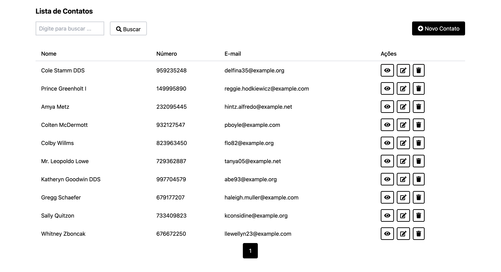

# Gerenciador de Contatos 📇


## Sobre o Projeto

O **Contact Manager** é uma aplicação web desenvolvida em Laravel, projetada para gerenciar contatos de forma eficiente e intuitiva. Com funcionalidades CRUD (Create, Read, Update, Delete), este projeto oferece uma interface amigável para adicionar, visualizar, editar e deletar contatos.

### Funcionalidades

- **Listagem de Contatos**: Veja todos os contatos cadastrados com facilidade. 📋
- **Adição de Novos Contatos**: Cadastre novos contatos com detalhes como nome, contato e e-mail. ➕
- **Visualização de Contatos**: Acesse os detalhes de cada contato. 👀
- **Edição de Contatos**: Atualize informações de contatos existentes. ✏️
- **Deleção de Contatos**: Remova contatos de forma segura com a deleção suave. 🗑️

### Considerações Técnicas

- **Validação**: Nome (>5 caracteres), Contato (9 dígitos) e E-mail (formato válido) com unicidade.
- **Autenticação**: Algumas funcionalidades são restritas a usuários autenticados.
- **Testes**: Cobertura de testes para validação de formulários.
- **Arquitetura**: Implementação de camadas de Services e Repository para uma arquitetura limpa e manutenível.

## Começando

Para configurar e executar o projeto localmente, siga estes passos:

### Pré-requisitos

- PHP 8.1
- Composer
- Laravel 10

### Instalação

1. Clone o repositório:
   ```sh
   git clone https://github.com/billyfranklim1/contact-manager.git
   ```
2. Instale as dependências do PHP:
   ```sh
   composer install
   ```
3. Configure o ambiente copiando o `.env.example` para `.env` e ajustando as variáveis de ambiente conforme necessário.
4. Gere uma chave para a aplicação:
   ```sh
   php artisan key:generate
   ```
5. Execute as migrações para criar a estrutura do banco de dados:
   ```sh
   php artisan migrate
   ```
6. (Opcional) Popule o banco de dados com dados de teste:
   ```sh
   php artisan db:seed
   ```

## Uso

Após a configuração, você pode iniciar o servidor de desenvolvimento do Laravel:

```sh
php artisan serve
```

Acesse a aplicação em `http://localhost:8000`.

## Testes

Execute os testes para garantir que tudo esteja funcionando como esperado:

```sh
php artisan test
```

## Contribuições

Contribuições são o que fazem a comunidade open source um lugar incrível para aprender, inspirar e criar. Qualquer contribuição que você fizer será **muito apreciada**.

1. Faça o Fork do projeto
2. Crie sua Feature Branch (`git checkout -b feature/AmazingFeature`)
3. Commit suas mudanças (`git commit -m 'Add some AmazingFeature'`)
4. Push para a Branch (`git push origin feature/AmazingFeature`)
5. Abra um Pull Request


## Contato

Meu Portfólio: [billy.dev.dev](https://billy.dev.dev)

Meu LinkedIn: [Billy Franklim](https://www.linkedin.com/in/billyfranklim/)

E-mail: [billyfranklim@gmail.com](mailto:billyfranklim@gmail.com)

Link do Projeto: [https://github.com/billyfranklim1/contact-manager](https://github.com/billyfranklim1/contact-manager)
